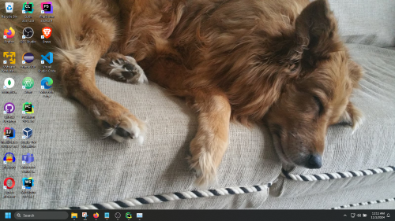

## My Technology Timeline

To the best that my wetware memory can recall, this is a compendium of explorations to develop skills and work with devices and tools in the technology sector. 

---

2025 – Personal Journal MIT License via GitHub

2025 – JJC Cybersecurity Teaching Engagement

2024 – Full Stack Series MIT License via GitHub

2024 – AI Prompting Techniques Presentation

2023 – First use of GPT prompting agent 

2023 – In-Browser Notepad MIT License via GitHub

2022 – North Central College Teaching Appointment

2022 – University of St. Francis Teaching Appointment

2021 – GSU Master of Science in Computer Science 

2020 – Co-Develop JJC Full Stack Bootcamp Program 

2020 – GSU Graduate Research Published 

2018 – Complete JJC Computer Programming, A.A.S.

2018 – JJC Computer Science Faculty Appointment 

2018 – Visiting Data Scientist with USGS (usgs.gov)

2018 – JJC Adjunct Instructor of Computer Science (CS) Appointment 

2017 – Joliet Junior College (JJC) Computer Science Tutor Appointment 

2015 – UW Python Programming Certificate Earned

2015 – Python Software Title Published (Luhn Algorithm) MIT License

2014 – UW Database Management Certificate Earned

2014 – UW Information Technology Certificate Earned

2013 – UW Web Technologies Certificate Earned

2012 – First Certificate Earned (CTC Chicago Training Center) JavaScript and Java Programming

2012 – Enter University of Washington (UW) Programming School

2011 – Manage First SQL Database 

2010 – First Programming Script (JavaScript)

2008 – First use of Linux as Ubuntu

2007 – U.S. Patent Received; #7,237,658 Frictional Brake Mechanism

2006 – U.S. Patent Received; #7,048,599 Manually Propelled Watercraft & Propulsion Mechanism

2003 – Learn HTML / Start using Social Media for Public Relations

2002 – Bacon's RDBMS PR Associate Training

1997 – Start with eMail

1995 – First Website Visit (Netscape)

1994 – Learn Microsoft Office Excel

1993 – Learn Microsoft Office Word

1991 – My First Computer (https://en.wikipedia.org/wiki/Macintosh_Portable)

1990 – Learn MS-DOS

1989 – Lotus 123, WordPerfect

---

#### Windows 11 Developer Rig November 2024</h2>

'The most efficient way to reverse sort a list often depends on the circumstances, but look to standard libraries first for accurate and tested outcomes.' ~ me

---

My Mirrored Technology Timeline
1989 – Lotus 123, WordPerfect

1990 – Learn MS-DOS

1991 – My First Computer (https://en.wikipedia.org/wiki/Macintosh_Portable)

1993 – Learn Microsoft Office Word

1994 – Learn Microsoft Office Excel

1995 – First Website Visit (Netscape)

1997 – Start with eMail

2003 – Learn HTML / Start using Social Media for Public Relations

2006 – U.S. Patent Received; #7,048,599 Manually Propelled Watercraft & Propulsion Mechanism

2007 – U.S. Patent Received; #7,237,658 Frictional Brake Mechanism

2008 – First use of Linux as Ubuntu

2010 – First Programming Script (JavaScript)

2011 – Manage First SQL Database 

2012 – First Certificate Earned (CTC Chicago Training Center) JavaScript and Java Programming

2012 – Enter University of Washington (UW) Programming School

2013 – UW Web Technologies Certificate Earned

2014 – UW Database Management Certificate Earned

2014 – UW Information Technology Certificate Earned

2015 – UW Python Programming Certificate Earned

2015 – Python Software Title Published (Luhn Algorithm) MIT License

2017 – Joliet Junior College (JJC) Computer Science Tutor Appointment 

2018 – JJC Adjunct Instructor of Computer Science (CS) Appointment 

2018 – Complete JJC Computer Programming, A.A.S.

2018 – JJC Computer Science Faculty Appointment 

2018 – Visiting Data Scientist with USGS (usgs.gov)

2020 – Co-Develop JJC Full Stack Bootcamp Program 

2020 – GSU Graduate Research Published 

2021 – GSU Master of Science in Computer Science 

2022 – University of St. Francis Teaching Appointment

2022 – North Central College Teaching Appointment

2023 – In-Browser Notepad MIT License via GitHub

2023 – First use of GPT prompting agent 

2024 – Prompt Engineering Presentation 

2024 – Full Stack Series MIT License via GitHub

2025 – JJC Cybersecurity Teaching Engagement

2025 – Personal Journal MIT License via GitHub

&copy; Clinton Garwood  
[Home](../Hello_World.md) | [Work](../Experience) | [Apps](../Code_Apps) | [Degrees](../Degrees) 
