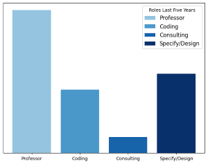
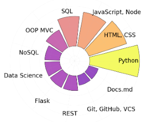

## Hello World, I am Clinton Garwood.

---

The resume data presented here is of a background biographical nature, and is subject to update, removal and change without notice.

There are no NDA covered or incubated projects described in this repository. 

---

## Professional Overview 
My background is very diverse with experience in product design, intellectual property (ip) creation, brand strategy development, and data science project management. 

### Software Design, Full Stack Development
I bring a strong foundation of best practices to programming and web applications projects, from design through implementation in academic and applied settings. I aspire to elevate society through accessible technology.

### Programming and Project Experience
[Experience Full List](Experience/_Experience_Summary_Garwood_Clinton)
  - [Code and Apps List](Code_Apps/_Summary_Open_Source_Apps_Garwood_Clinton)
  - [Data Scientist USGS](Experience/Visiting_Scientist_USGS_Garwood_Clinton.md)
  - [Faculty Joliet Junior College](Experience/Faculty_Joliet_Junior_College_Garwood_Clinton.md)

&nbsp;&nbsp;

*Five-Year Role Weight Comparison*

---

### Skills and Tools
- [Summary List Skills and Tools](Experience/Skills_Tools_Summary_Garwood_Clinton.md)
- [Summary Personal Technology Timeline](Experience/Technology_Timeline_Garwood_Clinton.md)

&nbsp;&nbsp;

*Programming Skill Highlights*

---

### Academic and Learning Pathway
- [Degree Full List](Degrees/_Degrees_List_Garwood_Clinton)
  - [M.S. Computer Science Governors State University](Degrees/MS_Governors_State_University_Garwood_Clinton.md)
  - [A.A.S. Computer Programming Joliet Junior College](Degrees/AAS_Joliet_Junior_College_Garwood_Clinton.md)
  - [Database, Programming, IT Certificates University of Washington](Degrees/University_of_Washington_Garwood_Clinton.md)

&copy; Clinton Garwood  
[Home](./Hello_World.md) | [Work](./Experience) | [Apps](./Code_Apps) | [Degrees](./Degrees) 
